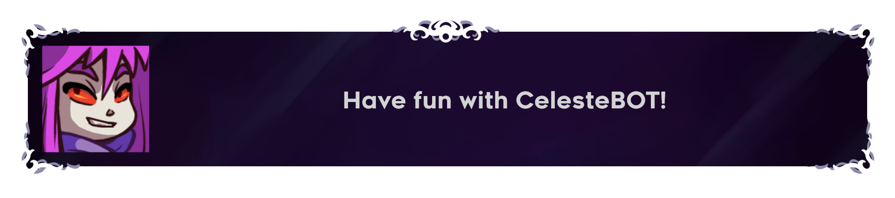

<h1 align="center">
  <br>
  
  <br>
  CelesteBOT
  <br>
</h1>

<p align="center">
Create dialog boxes in the style of <a href="https://www.celestegame.com/">Celeste</a> directly inside of Discord.
</p>

<p align="center">
  <a href="https://discord.com/application-directory/1233051271280328745">App Directory</a>
  •
  <a href="https://discord.gg/ZRYC8R4W">Community Server</a>
  •
  <a href="https://github.com/UltimateCartX/CelesteBOT/wiki">Wiki</a>
</p>

# Features
- Easily create dialog boxes.
- ...
- That's it! (for now)

<p align="center">

</p>

> :warning: **Caution:** The bot is still under development so bug *are* to be expected.

> :memo: By using the bot, you agree to the CelesteBOT's [Terms of Service](https://github.com/UltimateCartX/CelesteBOT/blob/main/TOS.md) and [Privacy Policy](https://github.com/UltimateCartX/CelesteBOT/blob/main/PRIVACY.md)

# Source
Want to host the bot yourself and customize every features to your likings? Follow the instructions below:
## Prerequisties
- [Node.js](https://nodejs.org/en/) (v16.11.0 or higher)
- [Git](https://git-scm.com/downloads)
## Installation
- Open a terminal in your desired directory and run these commands:
```bash
git clone https://github.com/UltimateCartX/CelesteBOT.git
cd CelesteBOT/source
npm install
```
- Add your bot's token and application id in `config.json`
- Run `npm run start` to start the bot!
## Customization
With your own instance of the bot, you can add, edit or remove pretty much anything! Follow the [wiki](https://github.com/UltimateCartX/CelesteBOT/wiki) for more information on how to customize the features.
# Contribution
There are 6 ways you can contribute to the project:
- **Talking about it and sharing it online**
- **Reporting bugs and issues**
- **Suggesting new ideas** 
- **Adding or updating locales**
- **Forking and improving the bot**
- **Donating money on my [Ko-Fi page](https://ko-fi.com/ultimatecartx)**

> :warning: There will NEVER be features exclusive to donators
# Credits
The textures used to create dialog boxes are from the game [Celeste](https://www.celestegame.com/) and are owned by [Maddy Makes Games, Inc](https://www.maddymakesgames.com/)
